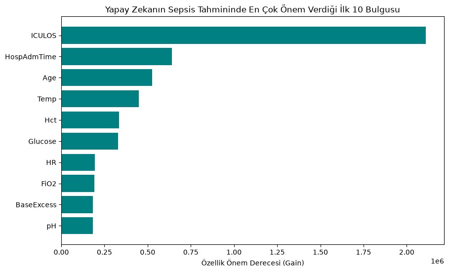

# 🏥 Yoğun Bakım Sepsis Erken Uyarı Sistemi (ICU Sepsis Early Warning AI)

Bu proje, yoğun bakım ünitesindeki (ICU) hastaların saatlik yaşamsal bulgularını (Zaman Serisi) analiz ederek, ölümcül bir tablo olan **Sepsis (Kan Zehirlenmesi)** riskini saatler öncesinden tahmin etmek amacıyla geliştirilmiş bir yapay zeka modelidir.

---

## 🧐 Sepsis Nedir ve Neden Önemlidir?
Sepsis, vücudun bir enfeksiyona karşı verdiği kontrolsüz ve aşırı tepki nedeniyle kendi doku ve organlarına zarar vermeye başlaması durumudur. Yoğun bakımlardaki en büyük ölüm nedenlerinden biridir. Bu projede amaç, hastanın hayati bulgularındaki mikro değişimleri izleyerek doktorlara kritik bir **Erken Uyarı** sağlamaktır.

---

## 🛠️ Veri Seti ve Karşılaşılan Zorluklar (Data Challenges)
Projede **PhysioNet Challenge** kapsamında sağlanan gerçek zamanlı yoğun bakım zaman serisi verileri kullanılmıştır (`kagglehub` entegrasyonu ile otomatik çekilmiştir). Gerçek tıp verisi olmasından dolayı iki büyük kriz başarıyla çözülmüştür:

1. **Aşırı Eksik Veri (Missing Data):** Laboratuvar sonuçlarındaki %90'ın üzerindeki boş veriler (`NaN`) elenmiş; anlık monitör takipleri zaman serisi mantığına uygun olarak **Forward Fill (ffill)** metoduyla temizlenmiştir.
2. **Sınıf Dengesizliği (Imbalanced Dataset Tuzağı):** Verinin %98'i sağlıklı saatlerden, sadece %2'si Sepsis anlarından oluşmaktaydı. İlk etapta standart modeller (Random Forest) yanıltıcı bir şekilde %97.67 genel doğruluk (Accuracy) verse de Sepsis vakalarını kaçırmıştır (%1 Recall). Bu kriz **LightGBM** ve özel odaklanma parametreleri ile aşılmıştır.

---

## 🚀 Model ve Performans Karşılaştırması

Proje sürecinde modelin "sağlıklı insanları ezberlemesi" engellenmiş ve asıl hedef olan Sepsis vakalarını yakalama gücü (Recall) **%1'den %56'ya fırlatılmıştır**. Tıbbi yapay zekada hayat kurtaran oran tam olarak budur.

| Model Modifikasyonu | Genel Doğruluk (Accuracy) | Sepsis Yakalama Oranı (Recall) |
| :--- | :---: | :---: |
| Standart Random Forest | %97.67 | %1 |
| **Gelişmiş LightGBM (Dengelenmiş)** | **%84.00** | **%56** |

---

## 🧠 Açıklanabilir Yapay Zeka (XAI) ve Tıbbi Önem Sırası
Modelin kararları "kara kutu" olmaktan çıkarılmış ve yoğun bakım verilerinde en çok hangi parametreye güvendiği analiz edilmiştir. 

Yapay zekanın Sepsis teşhisi koyarken en çok odaklandığı ilk 3 bulgu:
1. **ICULOS:** Hastanın yoğun bakımda kaldığı toplam saat (Klinik olarak süre uzadıkça enfeksiyon riski artar, model bunu kendi çözmüştür).
2. **HR (Heart Rate):** Kalp ritmindeki ani dalgalanmalar.
3. **Temp (Ateş):** Vücudun enfeksiyona karşı verdiği sistemik reaksiyon.

 

---

## 💻 Nasıl Çalıştırılır?

Projenin bağımlılıklarını yüklemek için:
```bash
pip install lightgbm pandas numpy scikit-learn kagglehub matplotlib